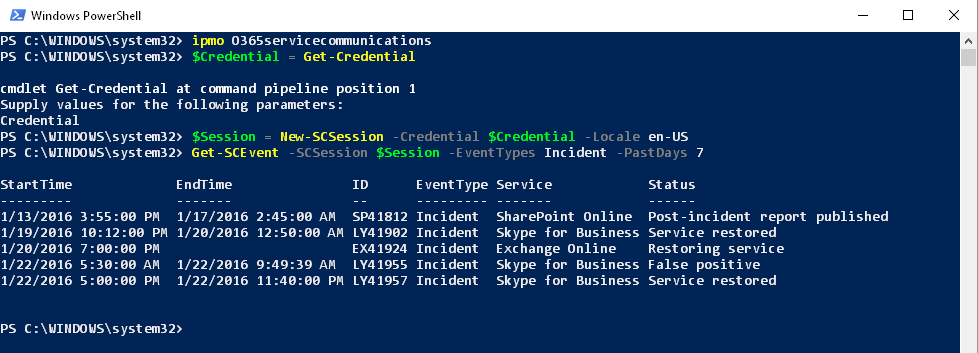

__Build Status:__ [/statusIcon)](https://build.powershell.org/project.html?projectId=O365ServiceCommunications&tab=projectOverview&guest=1)

# O365ServiceCommunications
A Powershell module for retrieving data from the Office 365 Service Communications API. This could be used for reporting the health status of your tenant over time, or for alerting when new incidents are posted.

###Getting Started
You'll need to be a global administrator for an Office 365 Tenant, or a delegated partner for an Office 365 tenant.

###Functions

#####New-SCSession
Use this function to authenticate to the Service Communications API and create a persistent session. This endpoint returns a cookie that is valid for 48 hours.

#####Get-SCEvent
Collect events from your Office 365 tenant. Event types are Incident, Maintenance, and Message.

#####Get-SCServiceInfo
Returns information about what services are available in your tenant.

#####Get-SCTenantEvent
Similar to Get-SCEvent, but for partner administrators.

#####Get-SCTenantServiceInfo
Similar to Get-SCServiceInfo, but for partner administrators.

###How to use it
Check out the sample folder for a demonstration of using this module to generate an email on current service incidents.

###API Overview
https://msdn.microsoft.com/en-us/library/office/dn776043.aspx

###API Code Samples
https://www.microsoft.com/en-us/download/details.aspx?id=44012
